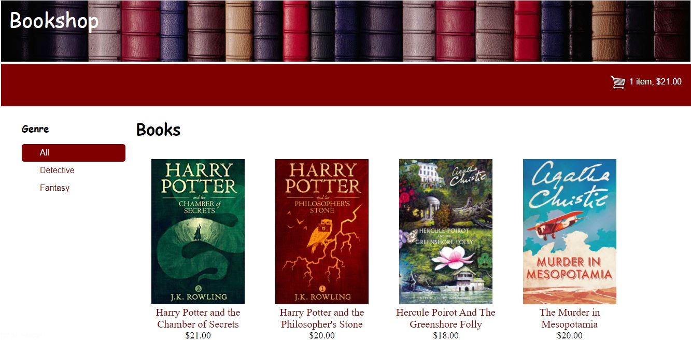
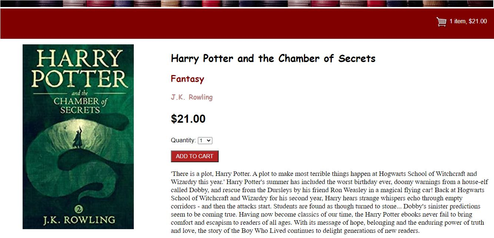
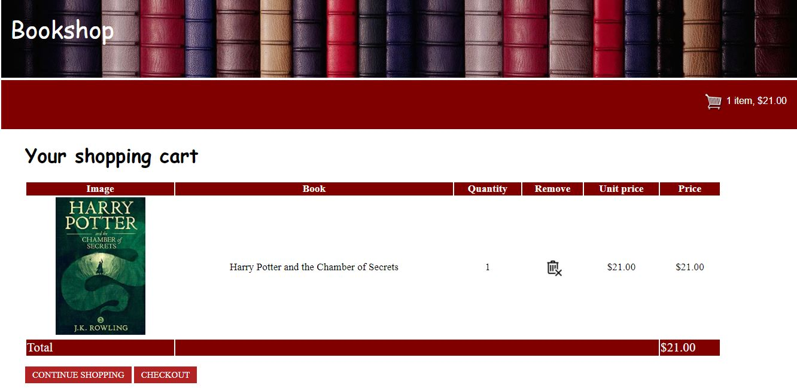
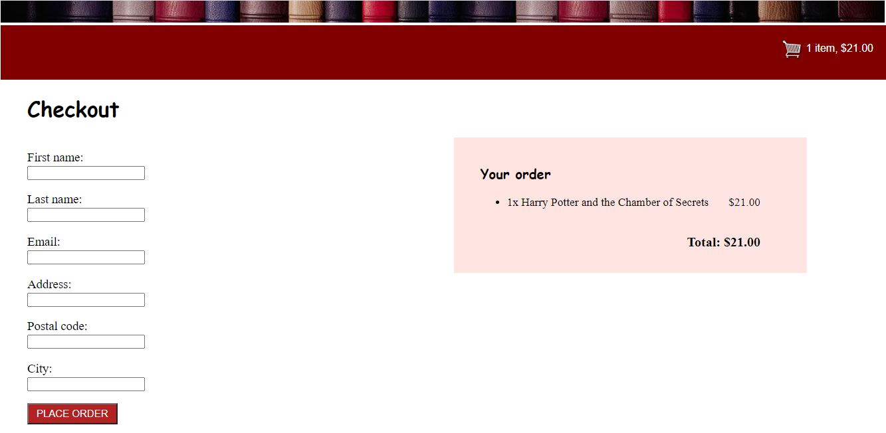

# Bookshop-Website-Django
Simple bookshop website created using Django Web Framework.

# Description
The created site allows you to view the books that are in stock, add them to the cart and place an order from it. Also site uses Celery with RabbitMQ to send email messages to users after placing the order.

## Main page
On the main page you can select a book to learn more about it, or go to the shopping cart if it is not empty.

## Book detail 
On the book detail page you can read more about the chosen book and add it to the shopping cart.

## Cart
On the cart page you can view all the items in it and place an order or continue shopping.

## Order
On the order page you can place the order.

